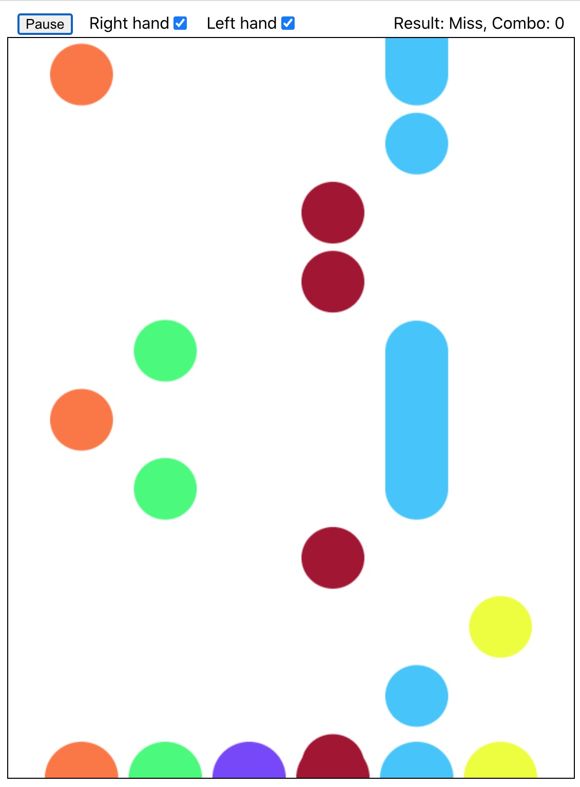

This is a a classical rythm game created using Hooks and [Tone.js](https://github.com/Tonejs/Tone.js). This is how it looks:



Alongside the playing music, drops fall down and we hit the bottom circles to keep up with the rythm. There are several features:

1. 3 hit results according to the timing: **Perfect**, **Good**, and **Miss**. The **combo** count is recorded.
2. Left hand buttons(from left to right): **a**, **s**, **d**. Right hand buttons(from left to right): **j**, **k**, **l**. We can choose to open left, right, or both hand tracks.
3. The music can be played, paused, resumed and stopped.

Please check the [link](https://imagicbell.github.io/front-end/2021/01/07/rythm-game.html) for detailed illustration of how I made it.


### How to Run

It is created from `create-react-app`, so to run the demo:

```shell
yarn start
```

to test the demo:

```shell
yarn test
```

